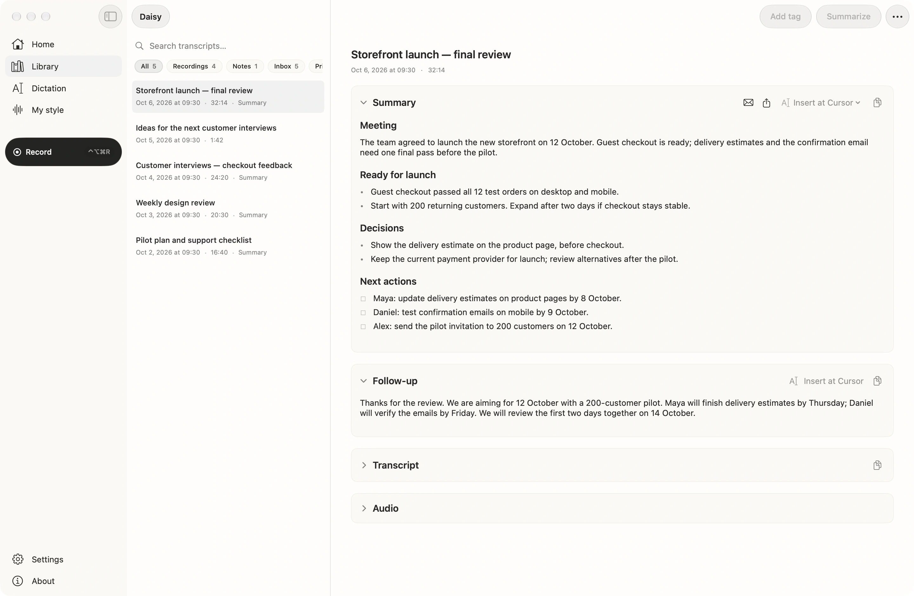

# Daisy

A Mac app that records your meetings and transcribes them on-device, with a local MCP server so Claude can read your calls.



## Download

- **[Latest release on GitHub](https://github.com/ca33u/daisy-app/releases/latest)** or **[mydaisy.io](https://mydaisy.io)** — the same signed, notarized DMG.
- Apple Silicon (M1 or later), macOS 14 Sonoma or later. Intel Macs are not supported: the DMG is a universal build, but Intel builds are untested. The Apple Intelligence summarizer and the Apple SpeechAnalyzer dictation engine need macOS 26.
- Updates arrive in the app through Sparkle.

## Privacy, checkable

- **Stays on the Mac:** audio, transcripts, summaries and speaker voice fingerprints, as plain files under `~/Library/Application Support/Daisy` (or a folder you pick). Transcription and speaker separation run on-device. No account, no telemetry, no analytics SDK.
- **Leaves only after you turn it on:** transcript text, never audio, to the cloud summarizer you set up (Anthropic, OpenAI, Kimi or Cursor on your key, or your ChatGPT account); meeting titles and attendee names to Anthropic web search if you enable attendee research; a session you send to Notion, Linear, Slack, a webhook or another MCP server; session text, summaries, voice fingerprints and screenshots to your own iCloud if you turn on iPhone sync (audio never goes through the cloud); Google sign-in if you connect Google Calendar; a crash report to Sentry (`*.ingest.de.sentry.io`), only when you press Send after a crash — Daisy asks on the next launch and shows the whole report first: where it failed, the app and macOS versions and the Mac model.
- **Otherwise the network sees:** the update check and download from `mydaisy.io`, and the one-time download of the speech models you chose from `huggingface.co` (on macOS 26, Apple's speech engine fetches its language files from Apple).
- **Check it yourself in ten minutes:** block Daisy in a firewall, set the summarizer to Apple Intelligence or a local model, record a meeting, and you still get a transcript and a summary. The steps and the hosts the app can reach are at <https://mydaisy.io/verify-local>.

## MCP in five minutes

Daisy runs an MCP server inside the app, so Claude Desktop, Claude Code, Cursor or Codex can search and read your meetings.

1. In Daisy, open **Settings → Connections → MCP server** and turn on **MCP server**.
2. Next to **Claude**, click **Connect**, then restart Claude. One connection covers its chats, Cowork and the Code tab. Nothing to install: the entry Daisy writes into `claude_desktop_config.json` runs a few lines of `/bin/sh` and `/usr/bin/curl`, both part of macOS (no Node.js, no `npx`). Claude Code in the Terminal, Codex and Cursor have their own **Connect** buttons on the same screen.
3. Ask Claude something like *"What did we decide about the launch date in last week's calls?"*

By hand: clients that speak Streamable HTTP use `http://127.0.0.1:54321/mcp` directly, with the header `Authorization: Bearer <access token>` (the token is on the same screen, under **Privacy → Access token → Copy**). For Claude Code:

```bash
claude mcp add --scope user --transport http daisy http://127.0.0.1:54321/mcp --header "Authorization: Bearer <access token>"
```

Claude's own config file takes only a command, not a URL; let Daisy write that entry, or use any stdio-to-HTTP bridge such as `mcp-remote`.

Tools:

| | Tools | What they do |
|---|---|---|
| **Read** | `list_sessions`, `get_session`, `search_sessions`, `list_folders`, `list_destinations` | Read your sessions, folders and configured destinations. |
| **Edit, local** | `set_session_title`, `rename_speaker` | Rename a session or name a speaker. Reversible: set the old title again, or pass an empty name to clear a speaker (a voice profile saved by the rename stays until you forget it in Settings). |
| **Act, off by default** | `resummarize_session`, `route_session_to_destination`, `route_action_to_destination` | Regenerate a summary (replaces the stored one; uses your summarizer, which may be a cloud provider), or send a session or one next step to Notion, Linear, Slack, a webhook or another MCP server. Each send creates a new page, issue or message there. Enabled only after you turn on **Privacy → Allow actions from MCP clients**. |

No tool can delete a session, audio or a transcript, or change Daisy's settings.

How the server is fenced:

- It binds to `127.0.0.1` only, so nothing outside your Mac can reach it, and it rejects requests whose `Host` or `Origin` is not local.
- New setups require a bearer token kept in the Keychain, so other programs on your Mac can't read your transcripts without it.
- The default port is `54321`; you can change it under **Advanced** on the same screen.

More: <https://mydaisy.io/docs/mcp>.

## License

Apache License 2.0. You can use, modify and redistribute the code, including commercially, as long as you keep the license and copyright notices. Full text in [`LICENSE`](./LICENSE).

## What it does

Three capture modes, one app:

- **Meetings** — records both sides of a call (your mic + the other side via system-audio loopback), no bot joining the meeting. On-device transcription + diarization (`Remote A` / `Remote B`, with optional mic-side attribution), a summary, action items, and a draft follow-up. Optional extras include periodic screenshots with on-device OCR, a preparation brief built from the agenda and past sessions, evidence-backed progress against the meeting plan, local meeting analytics, and custom meeting apps beyond the built-in list.
- **Push-to-talk dictation** — hold a hotkey, speak, and the text is pasted at your cursor in any app. Three on-device engines: Whisper (default), Parakeet (FluidAudio) for lower latency, and Apple SpeechAnalyzer on macOS 26 (zero download). A custom-vocabulary dictionary fixes names/jargon, an optional voice profile learns your phrasing, and a rolling 24-hour history lets you re-copy.
- **Voice notes** — quick one-off thoughts saved to your Library. Optional: import existing **Apple Voice Memos** as flat transcripts (on-device, opt-in, needs Full Disk Access).

Around the edges: morning and end-of-day summaries on Home, an opt-in keyboard-layout auto-fixer (retypes text entered in the wrong layout, with undo and per-app exceptions), and provider-returned ChatGPT plan-window usage plus local token accounting for API providers. The UI is localized in English and Russian.

The differentiator: Daisy ships a **local MCP server** bound to `127.0.0.1` that exposes your sessions as a queryable, actionable data source to any MCP client (Claude Desktop, Cursor, Codex). Because the transcript is already local, Daisy can be a local-only MCP source — something cloud meeting tools structurally can't offer.

## Build from source

Requirements:

- Xcode 26+ (ships the macOS 26 SDK the project builds against). The app itself runs on macOS 14+.
- An active Apple Developer account if you want a signed local build (unsigned builds are fine for development inside Xcode)

Clone and open:

```bash
git clone https://github.com/ca33u/daisy-app.git
cd daisy-app
open Daisy.xcodeproj
```

The Swift Package Manager dependencies (Sparkle, WhisperKit via [`argmax-oss-swift`](https://github.com/argmaxinc/argmax-oss-swift), FluidAudio) resolve on first project load. Hit Run; the app launches.

## Project layout

```
Daisy/                  → SwiftUI app sources (PBXFileSystemSynchronizedRootGroup)
DaisyTests/             → unit tests
Benchmarks/             → reproducible WER/DER/JER scorer, product runner, and public evidence
Daisy.xcodeproj/        → Xcode project
scripts/
  release.sh            → end-to-end release: archive → notarize → DMG → sign → Sparkle appcast
  release-notes/        → per-version markdown bullets consumed by release.sh
  dmgbuild_settings.py  → dmgbuild config (Python) for the installer DMG
  assets/               → DMG background, app icons
build/                  → archive output (gitignored)
RELEASING.md            → branch/channel model and the release/promote/hotfix flows
```

Key services that drive the app:

- `CoreAudioMicRecorder` — CoreAudio mic capture with route-change recovery and the archive `.caf` writer (replaced the old AVAudioEngine tap to fix route-change/Bluetooth dropouts)
- `SystemAudioCapture` / `ProcessTapAudioCapture` — the remote side of a meeting. The main path on macOS 14.4+ is a Core Audio process tap (the smaller "System Audio Recording Only" permission; it keeps working with Bluetooth output). `SCStream` loopback is the fallback: on older macOS, before the tap permission is granted or after it is refused, when the tap fails to start, or when it hears nothing that `SCStream` does. Silent-capture detection and warnings
- `Transcriber` / `WhisperEngine` — WhisperKit on-device transcription with a Silero VAD pre-pass
- `ParakeetEngine` / `AppleSpeechEngine` — the two alternative dictation engines: FluidAudio Parakeet-TDT (low latency) and Apple SpeechAnalyzer (macOS 26, no model download); Whisper is the default
- Diarization + speaker memory — FluidAudio (Pyannote) labels remote voices; named speakers are remembered locally by a short voice fingerprint
- `DictationPaste` — pastes dictated text at the cursor via the Accessibility API, restoring your prior clipboard
- `RecordingSession` — orchestrates a session, owns calendar binding and auto-stop scheduling
- `Summarizer` — multi-provider LLM dispatch: Apple Intelligence (on-device), ChatGPT account, Anthropic, OpenAI, Kimi (Moonshot), Cursor API key, Ollama, LM Studio (local), or an MCP summarizer
- `SensitiveDataProtector` — optional on-device pseudonymization/redaction boundary for supported remote summaries
- `MeetingPreparation` / `MeetingPlanAnalysis` / `MeetingAnalytics` — pre-meeting context, evidence-backed agenda progress, and local call metrics
- `ScreenshotCapture` — opt-in periodic screenshots of the meeting window with Vision OCR; screen text flows into the transcript and summary
- `PreMeetingBrief` / `MorningBrief` / `EndOfDaySummaries` — local briefs assembled from your calendar and past sessions, plus an evening digest
- `VoiceProfile` — opt-in personalization learned from your dictations (and, optionally, your mic side of meetings)
- `LayoutAutoFix` — opt-in keyboard-layout auto-correction via a CGEvent tap, with undo and per-app exceptions
- `TokenLedger` — local token-usage accounting per cloud provider, shown on Home
- `MCPServer` — the local MCP server on `127.0.0.1`; exposes ten tools (five read, two local edits, three opt-in actions) to Claude Desktop / Cursor / Codex
- `VoiceMemoScanner` / `VoiceMemoIngestor` — opt-in, on-device import of Apple Voice Memos to Markdown transcripts
- Sparkle 2 — in-app auto-updates against `https://mydaisy.io/appcast.xml`

## Reproducible benchmarks

[`Benchmarks/`](./Benchmarks/) contains the product-pipeline runner, a neutral
standard-library scorer for WER/CER/DER/JER, fixtures, and published raw
evidence. The first public baseline is AMI `ES2004a`: Daisy 1.0.7.59 detected
4/4 speakers with 15.68% DER and 20.28% JER at a median 0.122× real time
across three warm runs on an M4 MacBook Air. It is one reproducible
diarization case, not a general accuracy
claim; Humla and OpenWhispr remain unscored until their raw output exists for
the exact same audio. See the [methodology and publication gate](./Benchmarks/README.md)
and the [public evidence](./Benchmarks/reports/public/).

## Release flow

```bash
DAISY_AUTO_PUSH=1 ./scripts/release.sh <shortVersion> <buildNumber> [stable|beta]
```

Beta is the default channel from `main`; stable is promoted from a soaked beta with `./scripts/release.sh promote <version>` (no rebuild). Six steps: archive → export → notarize → DMG → publish to the [daisy-web](https://github.com/ca33u/daisy-web) repo → inject an `<item>` into `appcast.xml` and commit. Vercel auto-deploys the site within a couple of minutes. Every stable version also becomes a [GitHub Release](https://github.com/ca33u/daisy-app/releases) with the same DMG (`./scripts/release.sh github-release <version>`). Full branch/channel model and the hotfix flow are in [`RELEASING.md`](./RELEASING.md).

Release notes for each version go in `scripts/release-notes/<shortVersion>.md` as a flat markdown bullet list (`- one line per change`). The script extracts those bullets and embeds them in the appcast `<description>` so Sparkle shows them in its update sheet.

## Support and contact

[](https://ko-fi.com/G3W723TUZD)

- Chat with the community → [Discord](https://discord.gg/JYCZRZXy6j)
- Questions, ideas, show-and-tell → [GitHub Discussions](https://github.com/ca33u/daisy-app/discussions)
- Product issues, feature requests → file an issue on this repo or email **support@mydaisy.io**
- Security disclosures → see [`SECURITY.md`](./SECURITY.md)
- Procurement / security review / tailored deployment → email **hello@mydaisy.io**
- End-user docs → <https://mydaisy.io/docs> · Privacy → <https://mydaisy.io/privacy>

## Credits

- [Sparkle](https://sparkle-project.org) — in-app auto-updates
- [WhisperKit](https://github.com/argmaxinc/argmax-oss-swift) by Argmax — Apple Silicon Whisper inference (part of the Argmax OSS SDK)
- [FluidAudio](https://github.com/FluidInference/FluidAudio) — Parakeet ASR + speaker diarization
- [FoundationModels](https://developer.apple.com/documentation/foundationmodels) — on-device summarization via Apple Intelligence (macOS 26+)
